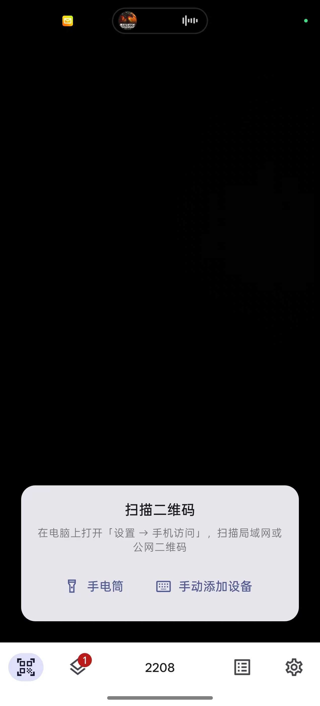
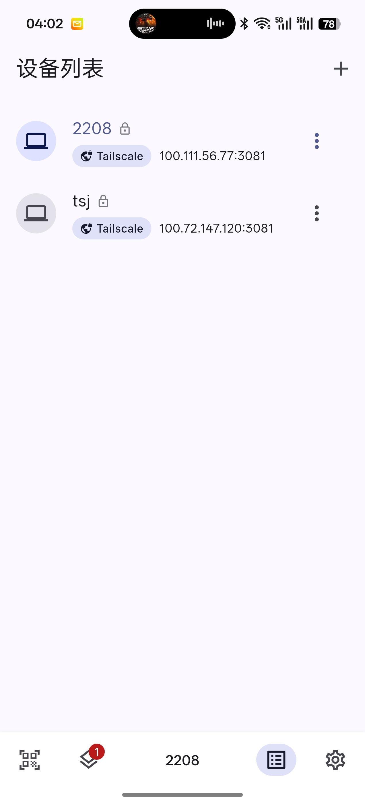
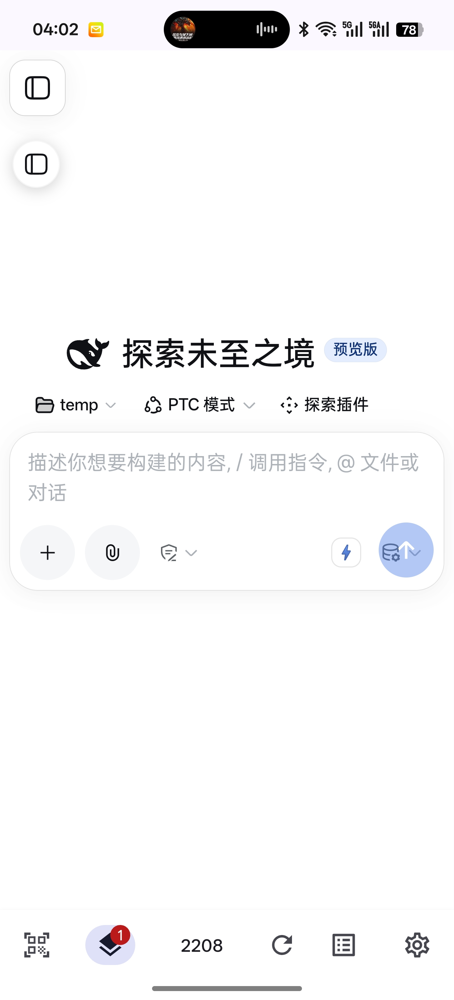
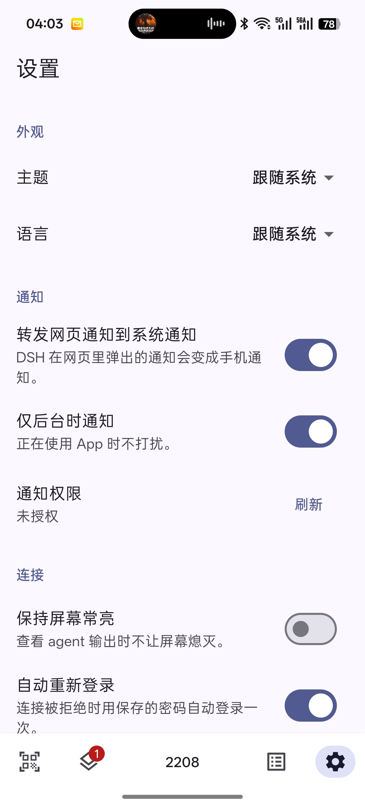

<h1 align="center">DSH Mobile Client</h1>

<p align="center">
  <strong>给电脑上跑着的 DeepSeek Harness 配一个手机 App：扫码即连、长期免密。</strong>
</p>

<p align="center">
  <a href="LICENSE"></a>
  
  
</p>

<p align="center">
  简体中文 · <a href="README.en.md">English</a>
</p>

---

## 这是什么

**DSH Mobile Client** 是 [Open DeepSeek Harness Desktop](https://github.com/flaqai/open-deepseek-harness-desktop)
（社区桌面版）与 [DeepSeek Harness](https://github.com/deepseek-ai/deepseek-harness) 的**移动端客户端**。

> **先说清楚：这个 App 里没有 DSH。**
>
> 它**不是**把 DeepSeek Harness 打包塞进手机，也**不是**在手机上跑一份 DSH。它是一层**外壳**：
> 用 WebView 打开**你电脑上已经跑着**的那个 DSH 网页，再补上浏览器做不到的几件事
> （访问密码存进系统密钥库、多设备管理、网页通知转成系统通知）。
>
> 模型调用、代码执行、文件读写、会话记录**全部仍然发生在你的电脑上**——手机是遥控器，不是主机。
> 电脑上的 DSH 没在跑，App 就是一块连不上的屏幕。
>
> 换句话说：DSH 本体来自上游两个项目，本项目只负责**把它套壳到手机里**，并让这层壳比浏览器好用。

桌面版自带的「手机访问」已经能把 DSH 暴露给手机浏览器，但用浏览器访问始终有几处不顺手：

| 浏览器访问的不便 | 本 App 的做法 |
|---|---|
| 电脑上 `dsh web` 一重启，手机上就要**重新输一次 8 位访问密码** | 密码存进系统密钥库（Android Keystore / iOS Keychain），App 自动重新登录，**不用再输** |
| 多台电脑 / 局域网 + Tailscale + 公网多个入口，只能靠书签分辨 | **设备列表**：扫码添加、自定义昵称、一键切换 |
| 网页通知在手机上收不到 | 网页里的通知**冒泡成手机系统通知** |
| 每次都要打开浏览器、找地址、输密码 | 打开 App 直接进入上次的设备 |
| 想有点个性 | **桌面伙伴**：动漫角色悬浮在手机桌面上（Android）——**暂缓，见下** |

## 界面

真机截图（Android）：

<p align="center">
  
  
  
  
</p>

从左到右：扫一扫添加设备 → 设备列表（同一台设备的局域网与 Tailscale 两个地址）→
连接后直接进入电脑上的 DSH 页面 → 设置（主题、通知转发、自动重新登录）。

## 功能

- **扫一扫连接** — 扫描电脑上「设置 → 手机访问」页面的二维码即可添加设备。
  也支持手动填写地址，以及直接扫描带 `?token=` 的分享链接（这种链接连密码都不用输）。
- **设备列表** — 支持多台 DSH；点击即切换，可重命名、改地址、删除。
- **设备昵称** — 每台设备都能取名字，昵称直接显示在底部导航栏中间；点一下回到这台设备，
  长按进入配置页。
- **不再被首次引导拦住** — DSH 的「初始化」弹窗对已经配置好的服务器没有意义，App 会替你
  点掉它自己的「跳过全部 → 开始体验」（设置页可关）。
- **一台设备两个地址** — 主地址之外再存一个「备用地址」（通常是 Tailscale 地址）。
  连接时两个地址同时探测、用先回应的那个：在家走局域网，出门走 Tailscale，不用手动切。
- **多设备同时在线** — 连上的设备各自保活一个会话（最多 4 个），切换是秒切，不重新加载、不用重新登录。
- **纯图标导航栏** — 扫一扫 / 运行实例数 / 设备名称 / 设备列表 / 设置 / 刷新，六个图标，不占文字。当前设备那一页不再有顶部标题栏，整屏都是网页。
- **通知转发** — 把网页通知变成手机通知；可选择「仅后台时通知」，正在用 App 时不打扰。
- **自动重新登录** — 保存的密码会在会话失效时自动重放，这是本 App 相对浏览器最大的差别。
- **Tailscale 远程访问** — 出门在外也能连回家里电脑（见下文）。
- ~~**桌面伙伴**~~ — **暂缓，界面上先不提供。** 代码、Android 悬浮窗服务和设置项都还在，
  只是设置里不再显示入口；想改随时可以在 `app/lib/core/pet/pet_feature.dart` 里打开。
  设计见 [docs/DESKTOP-PET.md](docs/DESKTOP-PET.md)。
- **自动更新** — 应用内检查 GitHub / Gitee 上的新版本，直接下载并调起系统安装器（见 [docs/RELEASING.md](docs/RELEASING.md)）。

## 工作原理

```
┌──────────────────────────────┐
│  DSH Mobile Client (本 App)  │
│                              │
│  ① 扫码得到 http://IP:3081   │
│  ② 密码存进 Keystore         │
│  ③ 连接时用 ?token=<密码>    │
│     重新登录（免手输）        │
│  ④ WebView 持久化会话 cookie │
└───────────────┬──────────────┘
                │  http(s)://<地址>:3081
                ▼
┌──────────────────────────────┐
│  dsh-pocket 认证代理 (:3081) │
│  · 按 Host 区分公网/局域网密码│
│  · 校验通过 → 种 30 天 cookie │
│  · Host/Origin 改写为 loopback│
│  · 注入 dsh web 启动 token    │
└───────────────┬──────────────┘
                ▼
┌──────────────────────────────┐
│  dsh web (127.0.0.1:3080)    │
│  官方 Web UI + 移动端布局适配 │
└──────────────────────────────┘
```

### 关键点：为什么 App 能做到「不用再输密码」

DSH 的网页会话是一个 cookie，而 `dsh-pocket` 把它的有效性**绑定到电脑上 `dsh web` 进程**：
进程一重启，旧 cookie 立刻失效，浏览器只会再把登录页摆到你面前。

App 的做法是**把密码留在手机的系统密钥库里**，并且每次连接都从
`/?token=<密码>` 这个入口进——服务端接受这个参数后会立刻种一个全新的 cookie。
于是「重启后要重新登录」这件事对用户不再可见：App 自己完成了一次登录，你只是打开了 App。

> 这也是本项目选择「套壳 + 注入适配层」而不是重写 UI 的原因：
> 官方 Web UI 才是功能最全、更新最快的那个界面。

## 快速开始

### 1. 电脑端准备

1. 安装并打开 **Open DeepSeek Harness Desktop**；
2. 确认插件 **`dsh-pocket`** 已安装（桌面版通常已内置）；
3. 打开 **设置 → 手机访问**，你会看到两个二维码：
   - **📶 局域网**：手机和电脑在同一个 Wi-Fi（或同一个 Tailscale 网络）时使用；
   - **🌐 公网**：点了「开启公网访问」之后出现，人在外面也能用。

> 建议在手机访问页面里把局域网密码**自定义成固定的 8 位密码**，
> 这样密码不会变，App 可以一直用它自动登录。

### 2. 安装 App

从 [Releases](../../releases) 下载 APK 安装，或者按下面的「构建」自行编译。

发布页有**两个包**，按手机情况选：

| 包 | 体积 | 适合 |
| :-- | :-- | :-- |
| `dsh-mobile-client-<版本>.apk` | ~70 MB | 一般手机。系统 WebView 较新，或者手机上已经装了更新的内核 |
| `dsh-mobile-client-<版本>-legacy.apk` | ~110 MB | **老手机**。内置了一份 Chromium，不依赖系统 WebView，也不要求用户装任何东西 |

拿不准就先装普通版；如果连上去是白屏，说明系统 WebView 太旧，换 legacy 版。

### 3. 扫码连接

1. 打开 App → 底部导航栏点 **扫一扫**；
2. 扫描电脑上「手机访问」页面的**局域网二维码**；
3. App 会预填地址，给设备起个昵称；这台机器如果还有别的入口（比如 Tailscale 地址），
   填进**备用地址**，以后会自动挑能通的那个。保存；
4. 页面要求密码时，App 会弹出输入框，**填电脑上显示的那 8 位**；
5. 之后每次打开 App 都会直接进入 DSH —— **不再需要输入密码**。

> 添加 / 编辑设备的表单里**没有密码输入框**，这是故意的。密码在你真正连上去、
> 服务器真的开口要的那一刻才问——那也是唯一能判断密码对错的时刻。
> 在表单里先填一遍，连上去还要再填一遍，是同一件事做两次。

### 4. 通知与桌面伙伴

- **通知**：默认开启。首次打开会请求系统通知权限；网页里的通知会变成手机通知。
- **桌面伙伴**：**暂缓**，设置里已经没有这个入口了。代码保留，见下一节。

## Tailscale 远程访问

想在 4G 下连回家里电脑，又不想把 DSH 暴露到公网，**Tailscale 是最省事的方案**：

1. 电脑和手机都装上 Tailscale 并登录同一个账号；
2. 在电脑上「手机访问」页面的**「局域网地址」下拉框**里，选中电脑的 Tailscale 地址
   （形如 `100.x.y.z`）——dsh-pocket 会把 CGNAT `100.64.0.0/10` 视为局域网，
   所以这里用的仍然是**局域网密码**，而不是公网密码；
3. 手机上用 App 连接 `http://100.x.y.z:3081`，密码填局域网密码。

这样流量只走你的 tailnet，不经过任何第三方公网入口。

> **在家别绕 Tailscale。** 第 2 步把「局域网地址」改成 Tailscale 地址之后，二维码里写的
> 就是 `100.x.y.z`——在家连着同一个 Wi-Fi 时也在绕 Tailscale。不用手动切：把主地址填成
> `http://192.168.x.x:3081`，**备用地址**填 `http://100.x.y.z:3081`，连接时两个同时探测，
> 谁先回应用谁。
>
> **如果一直很慢**，多半是没打通直连、走了 Tailscale 的 DERP 中继（官方节点都在境外）。
> 电脑上 `tailscale ping <手机名>` 看是 `direct` 还是 `via DERP(...)`；是中继的话，
> 路由器开 UPnP / NAT-PMP 能明显提高直连成功率。

> 注意：`100.64.0.0/10` 是 CGNAT 网段，手机必须真的在同一个 tailnet 里才连得上。

## 桌面伙伴

> **暂缓。** 功能本身是做完的，但界面入口先撤了——悬浮在桌面上的角色是新用户第一眼
> 看到的东西，还没打磨到能拿出手。代码、Android 悬浮窗服务和设置项都还在，
> 把 `app/lib/core/pet/pet_feature.dart` 里的 `PetFeature.available` 改成 `true` 就回来了。
> 下面这一节是设计说明，内容依然有效。

| 平台 | 能力 |
|---|---|
| **Android** | 角色可以悬浮在桌面 / 其他 App 之上，可拖动、点按回到 App；可换自己的角色图片。需要 `SYSTEM_ALERT_WINDOW` 权限。 |
| **iOS** | **系统不允许**第三方 App 覆盖桌面，因此只有应用内的角色展示（设置页预览）。这是平台限制，不是本项目偷懒。 |

内置角色由 Flutter（`CompanionPainter`）和 Android（`CompanionView`）分别绘制同一套图形，
所以设置页的预览和桌面上的样子是一致的。

**想换成真正的动漫角色？** 现在的结构是为此留的：

- 现在：内置矢量角色，或用户在设置里选一张自己的图片；
- 之后：把 `CompanionView.onDraw` 换成 Live2D / 精灵图渲染即可，
  服务、权限、MethodChannel 都不用动。详见 [docs/DESKTOP-PET.md](docs/DESKTOP-PET.md)。

## 技术栈与选型

**Flutter 3.35（Dart 3.9）**，一套代码同时出 Android 和 iOS。

选它的理由：

1. **需求 7 决定了必须是「一套代码 + 原生扩展」**：桌面伙伴只能靠 Android 原生
   悬浮窗（`TYPE_APPLICATION_OVERLAY` + 前台服务）实现，Flutter 通过一个
   MethodChannel 调它；如果为了这一件事拆成两套原生代码，前 6 条需求就要写两遍。
2. **角色可以是一个 Flutter Widget**：桌宠未来要动画、要 Live2D、要交互，
   Flutter 的渲染管线比「原生 + WebView」更好扩展。
3. **生态正好覆盖全部需求**：`flutter_inappwebview`（JS 注入 / Cookie）、
   `mobile_scanner`（扫码）、`flutter_local_notifications`（通知）、
   `flutter_secure_storage`（Keystore / Keychain）。

> 如果你只想要一个**几十 KB 的纯 WebView 壳**，可以参考
> [dsh-mobile-app](https://github.com/hongshuxifan321/dsh-mobile-app)（Android 原生，零依赖）。
> 本项目要的是「一个真正的 App」，所以选了 Flutter。

## 更新与发布

App 是 APK 直装、不走应用商店，所以「用户怎么知道有新版本」必须由项目自己解决：

| 环节 | 做法 |
|---|---|
| **发布** | GitHub Releases 与 Gitee Releases 同时发布，互为镜像 |
| **检查** | App 同时查询两边的公开 Release API，取版本号更高的那个 |
| **安装** | 下载 APK 后交给系统安装器，需要用户授予一次「安装未知应用」 |

打一个 tag 就会自动走完整个流程：

```bash
# 1. 改 app/pubspec.yaml 的 version: 1.1.0+2
# 2. 提交后打 tag，注释就是 App 里显示的「更新说明」
git tag -a v1.1.0 -m "免密登录更稳

- 修复 dsh web 重启后偶发要求重新登录"
git push origin master --tags
```

CI 会校验 tag 与 `pubspec.yaml` 是否一致、跑分析和测试、构建 APK、发 GitHub Release，再把同一个包镜像到 Gitee。

完整流程（Gitee 令牌配置、签名要求、版本号规则、手动兜底）见 **[docs/RELEASING.md](docs/RELEASING.md)**。

> ⚠️ 两个前提：仓库必须**公开**（私有仓库的 Release API 需要 token，而 token 不能打进 App）；
> 版本号必须**和 tag 一致**，否则 CI 直接失败——发出版本号对不上的包会让所有人的更新检查失灵。
>
> 如果你 fork 到自己账号下，构建时指定仓库地址：
> `--dart-define=DSH_GITHUB_REPO=you/dsh-mobile-client --dart-define=DSH_GITEE_REPO=you/dsh-mobile-client`

## 遇到白屏或连不上怎么办

这个 App **没有埋点、没有崩溃上报**，所以出问题时唯一的办法就是你把诊断信息发出来——那里面有定位所需的一切。

| 情况 | 怎么办 |
|---|---|
| **连不上** | 页面不再白屏，而是直接说明原因（超时 / 网络不通 / 服务器拒绝 / 页面空白），并给出对应建议。点「复制诊断信息」即可 |
| **平时** | `设置 → 诊断与反馈`：看日志、复制、分享，或直接跳到 GitHub Issues |

报告包含：设备型号、Android 与 **MIUI 版本**、**系统 WebView 的包名与版本**、当前设备地址、页面探测结果、本次与上一次运行的日志，以及页面里捕获到的 JS 异常和 `console.error`。

> 🔒 **访问密码和会话 Cookie 会被自动隐藏。** `?token=` 的值一律替换为 `<hidden>`；密码本身还会作为「已知密钥」被全文擦除，所以即使它出现在页面标题或报错信息里也留不下来。这不是可选项——擦除发生在日志写入时，调用方无法忘记。
>
> 这也是为什么白屏值得单独处理：它是唯一一种「页面加载成功了、但什么都没显示」的故障，没有错误码、没有异常，用户手上没有任何可反馈的东西。

### 白屏的根因与兼容层

DSH 的前端由 Vite 构建。Vite 只把**语法**降级到它配置的目标，**不 polyfill 运行时 API**——于是包里同时存在两类超出旧引擎能力的东西：

| 构造 | 需要 Chromium |
|---|---|
| 私有方法 `#name() {}` | 84 |
| `??=` / `\|\|=` / `&&=` | 85 |
| `static {}` 初始化块 | **94** |

**真正卡住的是语法，不是 API。** 语法错误意味着整个文件**一行都不会执行**——shim 再全也救不了。

现场的诊断报告把这一点钉死了：红米 K20 Pro 的系统 WebView 是 **Chromium 83**，日志里是

```
uncaught: Uncaught SyntaxError: Unexpected token '=' @ .../assets/index-DS_0SByp.js:2:8267
```

而那一位正好是 `p ??= H0(...)`。同一份报告里，shim 明明生效了（`compat: SHIMMED Object.hasOwn, ...`），页面却依然白屏——因为脚本根本没被解析。

App 因此做了两件事：

1. **兼容 shim**：在页面脚本之前补齐 bundle 用到的运行时 API（清单见下一节）。它们在旧引擎上是真的有用（那类设备语法没问题、只缺 API），在够新的引擎上完全不生效。
2. **版本闸门**：WebView 低于 Chromium 94 时直接给出说明页，而不是白屏。门槛取 94（`static {}`）而非 85（`??=`）是刻意的——只修运算符只会把解析错误往后推几 KB。

低于 94 时**唯一的解法是换一个更新的内核**。把 bundle 改写到那个程度不是 shim，是转译器——`static {}` 没法在不理解所在类的情况下做文本改写。

### 能解析不等于能跑

第二份现场报告来自同一个用户、同一个机型，这次跑的是**内置内核**：

```
webViewKernel: upgraded kernel: bundled webview/armeabi-v7a.apk (now 113.0.5672.136)
loaded http://100.111.56.77:3081/
```

Chromium 113 解析得了、也挂载了，页面却连不上：

```
Uncaught TypeError: Promise.withResolvers is not a function @ http://100.111.56.77:3081/:47:65
[session-controller] control stream failed: TypeError: AbortSignal.any is not a function
[connection] connection lost, retry #1
```

所以 **94 只是「能解析」的门槛，不是「能跑」的门槛**。`Promise.withResolvers` 要 119、`AbortSignal.any` 要 116，两个都在 113 之上，而第二个正好落在会话控制流的第一次读取上——于是界面出得来、连接永远建不起来。

补上这两个之后，shim 的完整清单是（每一项都是**扫 bundle 扫出来的**，不是猜的）：

| API | 需要 Chromium |
|---|---|
| `String.prototype.replaceAll` | 85 |
| `Array.prototype.at` / `String.prototype.at` | 92 |
| `crypto.randomUUID` | 92，**且要求安全上下文** |
| `Object.hasOwn` | 93 |
| `Array.prototype.findLast` / `findLastIndex` | 97 |
| `AbortSignal.timeout` | 103 |
| `Array.prototype.toReversed` / `toSorted` / `with` | 110 |
| `String.prototype.toWellFormed` | 111 |
| `ArrayBuffer.prototype.transfer` | 114 |
| `AbortSignal.any` | 116 |
| `Object.groupBy` / `Map.groupBy` | 117 |
| `Promise.withResolvers` | 119 |
| `URL.canParse` | 120 |
| `Set.prototype.union` / `intersection` / `difference` | 122 |
| `URL.parse` | 126 |
| `Promise.try` | 128 |
| `Symbol.dispose` | 134 |
| `navigator.clipboard` | **要求安全上下文** |

### 自动改用手机上更新的内核

App 会尝试**复用手机上已经安装的更新内核**，而不是要求用户去动系统。实现基于 [WebViewUpgrade](https://github.com/JonaNorman/WebViewUpgrade)（MIT）：它劫持 WebView provider 的 binder，让**本进程**从另一个已安装的包解析 WebView。

**不替换系统 WebView、不影响其他应用、不需要 root**，用户卸载那个内核 App 即可撤销。

两个约束决定了实现方式：

- **时机**：provider 在进程内第一次创建 WebView 时就绑定，之后无法热切换。所以这段逻辑跑在 `WebViewKernelProvider`（一个 `ContentProvider`）的 `onCreate()` 里——它发生在 `bindApplication` 期间、`Application.onCreate()` **之前**，是唯一还来得及的窗口。已经创建过 WebView 再切换，需要冷启动 App 才生效。
- **只有完整单体 APK 能作为内核**：Google Play 分发的 Chrome 和 Android System WebView 是 split 安装包，**用不了**。所以从商店装的 Chrome 即使版本够新也不会被采用，需要完整版 APK。

没找到可用内核时不会白屏，而是给出说明页。Android 侧的 `MIN_CHROMIUM` 与 Dart 侧的 `CompatScript.minimumChromium` 有一个测试守着，防止两边漂移。

还有两个方向相反的坑：`crypto.randomUUID` 和 `navigator.clipboard` 都要求**安全上下文**，而本 App 是刻意用明文 HTTP 连局域网地址的——所以它们在**最新**的 WebView 上同样不存在。`crypto.getRandomValues` 和 `document.execCommand('copy')` 没有这个限制，于是也被一并补上。

每个 shim 都先检测原生实现，新设备上完全不生效。行为本身由 `tools/compat_check.mjs` 把关：它把原生实现**删掉**、换成我们的、逐项对比结果（`node tools/compat_check.mjs`，需要 Node 24+，CI 里会跑）。

有一件事**故意不做**：`structuredClone` 只在日志里报出来，不补。克隆写错会**静默**改坏状态，而方法缺失会在出错的地方当场抛异常——后者在手机上才查得动。

### 内置内核的版本（legacy）

复用已装内核有个前提：**手机上得有一个够新的完整内核**。一台干净的老机器可能一个都没有。于是有一个把内核**直接打包进 App** 的版本。

它内置的是 **AOSP `com.android.webview` arm32**（Chromium 113，minSdk 24），启动时解出来当内核用——**不安装任何东西、不碰系统、用户无感**。

解包**由 App 自己做**，而不是用 WebViewUpgrade 的 `UpgradeAssetSource`：后者每次启动都会重新拷一遍，而且在后台线程上做，于是存在一个窗口——这次会话的第一个 WebView 可能仍按旧系统内核创建，而那个绑定一旦发生就收不回去。自己拷贝发生在 `ContentProvider.onCreate` 里，早于进程内任何可能创建 WebView 的代码。

同理，**内置内核这条路在换内核之前不向 WebView 问任何问题**（连「系统当前用的是哪个内核」都不问）。库的 `checkPreconditions` 明确要求 `WebViewFactory.sProviderInstance == null`，早一点是确定安全的，早问一句则要靠推理——不如不推理。

代价是磁盘：解出来的内核（~85 MB）加上它里面的 native 库（~64 MB），App 数据大约 **150 MB**。只在首次启动解一次，之后走缓存。

两个设计选择：

- **为什么是 arm32**：arm64 的单体内核接近 200 MB，arm32 只有 85 MB。所以 legacy 版本**自己也是 32 位构建**（`--target-platform android-arm`），让进程 ABI 和内核匹配。32 位 App 在 arm64 手机上照常运行，覆盖面反而更广。
- **为什么是 AOSP 而不是 Google 版**：再分发许可上最干净，而且这个版本本来就是给老机器兜底的，差别不重要。
- **为什么按进程 ABI 找内核**：`Build.SUPPORTED_ABIS` 描述的是设备而不是进程——64 位手机上的 32 位进程会先把 `arm64-v8a` 报在前面，而 arm64 内核装不进 32 位进程。所以先按 `Process.is64Bit()` 把列表切成匹配的那一半。
- **为什么 legacy 包只打 armeabi-v7a**：Android 是按 APK 里的 native 库来定进程 ABI 的。某个插件的 AAR 只要带了 arm64 库，进程就会按 64 位起来，然后找不到 64 位的 Flutter 引擎。所以 legacy 变体用 `androidComponents.onVariants` 把 `arm64-v8a` / `x86_64` 排除掉，让这个选择没有歧义，顺带也小了一点。

内核有 85 MB，不适合进仓库，所以单独下载：

```bash
./tools/fetch_webview_kernel.sh    # 下载到 app/android/app/src/legacy/assets/webview/
```

默认从 [WebViewPackage](https://github.com/JonaNorman/WebViewPackage) 取，直连失败会自动走 ghproxy 镜像。可以用环境变量换厂商 / ABI / 版本：

```bash
DSH_WEBVIEW_KERNEL_VENDOR=google DSH_WEBVIEW_KERNEL_VERSION=119.0.6045.53_min24_arm32 \
  ./tools/fetch_webview_kernel.sh
```

> 内置的是第三方编译的 Chromium 二进制，再分发前请自行确认许可。仓库里只放机制和下载脚本，不放二进制。

**两个版本的更新是分开的。** 更新器会先按文件名把两个包分开，再挑 ABI，绝不交叉——给老设备推普通包会白屏，给普通用户推 legacy 包则白白多下 110 MB。这一点有测试守着。

## 构建

### 本地构建

需要：Flutter 3.35+、Android SDK（compileSdk 36）、JDK 17–23（Gradle 8.12 不支持 JDK 24+）。

项目有两个 flavor，所以 **`--flavor` 是必填的**：

```bash
cd app
flutter pub get
flutter analyze

# 普通版
flutter build apk --release --flavor standard
# 产物：app/build/app/outputs/flutter-apk/app-standard-release.apk

# 内置内核版（先跑一次 tools/fetch_webview_kernel.sh）
flutter build apk --release --flavor legacy --target-platform android-arm
# 产物：app/build/app/outputs/flutter-apk/app-legacy-release.apk
```

`flutter run` 同样需要 `--flavor standard`。

iOS 需要 macOS + Xcode：

```bash
cd app
flutter build ios --release
```

> 默认的 release 构建使用 debug 签名，方便直接 `flutter build apk --release`。
> **正式分发前请换成你自己的签名**：在 `app/android/app/build.gradle.kts` 里配置
> `signingConfigs`，并把 keystore 放在仓库外（`.gitignore` 已排除 `*.jks` / `*.keystore`）。

### 应用图标

图标（Android 自适应图标 + iOS AppIcon）是脚本画出来的，不提交无法编辑的二进制：

```bash
python3 tools/make_icons.py --ascii          # 在终端里看轮廓，不用装图片查看器
python3 tools/make_icons.py --preview p.png  # 出一张对照图：三种蒙版 + 各个尺寸
python3 tools/make_icons.py                  # 重画全部 PNG（需要 Pillow）
```

图案是一尾鲸尾（DeepSeek 蓝底 + 白色剪影，参考 DeepSeek 的鲸鱼标志，但不是它家的图形）。
轮廓由四条三次贝塞尔曲线定义，右半边是左半边的镜像，所以两边不会走形。
改颜色或比例就改脚本顶部的常量然后重跑；Android 的 legacy PNG、自适应前景与 iOS
全部尺寸会一起更新。

自适应前景按 108dp 画布作图、图案占 54% 宽——`--preview` 里能看到它落在安全圆内，
圆角方形和圆形蒙版都不会切到。

### 构建注意事项

- 部分插件（如 `flutter_inappwebview_android`）会把自己的 `compileSdk` 锁在旧版本，
  在只装了新平台 SDK 的机器上会报 `Failed to find Platform SDK with path: platforms;android-34`。
  `app/android/build.gradle.kts` 已把所有子项目统一抬到 36，无需手动装旧 SDK。
- Gradle 8.12 不支持 JDK 24 及以上，请用 JDK 17–23。
- 首次构建需要下载 Gradle 与依赖，耗时较长；之后是增量构建。
- **R8 会吃掉 WebViewUpgrade**。Flutter 默认给 release 打开 R8，而这个库的 AAR 里
  `proguard.txt` 是空的、不带 consumer rules，于是它会被混淆甚至删类——**构建照样成功、
  APK 照样能装，只是这个功能在它本该帮助的旧设备上静默失效**。
  `app/android/app/proguard-rules.pro` 里的 keep 规则就是为它准备的（Flutter 的 Gradle
  插件本来就引用这个文件，只是默认不存在）。改动依赖后如果怀疑这个功能没生效，
  可以在 `app/build/app/outputs/mapping/release/mapping.txt` 里搜 `com.norman.webviewup`：
  映射应该是恒等的，出现 `R8$$REMOVED$$CLASS$$` 就说明规则没生效。

## 项目结构

```
app/lib/
├── main.dart                      # 初始化服务、注入依赖
├── app.dart                       # 主题 / 语言 / 根路由
├── core/
│   ├── dsh/dsh_endpoint.dart      # 地址解析、Host 分类、token 提取
│   ├── models/                    # 设备与设置的数据模型
│   ├── storage/                   # JSON 文档 + 系统密钥库
│   ├── notifications/             # 通知服务 + 注入网页的 JS 桥
│   ├── browser/compat_script.dart # 注入页面的兼容 shim（旧 WebView 白屏的根因）
│   ├── diagnostics/               # 日志、脱敏、页面探测、反馈报告
│   ├── update/                    # 版本比较、GitHub/Gitee 查询、APK 下载
│   ├── platform/app_platform.dart # 系统设置页 / 安装 APK 的 MethodChannel
│   ├── pet/pet_platform.dart      # 悬浮窗 MethodChannel
│   ├── state/                     # ChangeNotifier 控制器
│   └── i18n/l10n.dart             # 中英文字符串表
└── features/
    ├── home/home_shell.dart       # 六图标底部导航 + 多会话保活
    ├── scanner/                   # 扫一扫
    ├── devices/                   # 设备列表 / 增删改
    ├── browser/dsh_webview.dart   # WebView 外壳 + 自动重新登录
    ├── settings/                  # 设置
    └── pet/                       # 角色绘制（与 Android 端一致）
```

## 安全与隐私

- **访问密码只存在系统密钥库**（Android Keystore / iOS Keychain），
  不写进普通配置文件；密钥库写入失败时**宁可报错也不回退明文**。
- 设备列表里**只保存「是否设置过密码」这个布尔值**，密码本身从不进内存缓存。
- App **不收集、不上传任何数据**，没有账号体系，没有统计埋点。
- 局域网明文 HTTP 是必要的（家用服务器没有证书），Android 侧已用
  `network_security_config` 说明原因；公网隧道始终是 HTTPS。
- DSH 能执行你电脑上的代码。**不要把二维码、地址或密码发给别人**；
  密码一旦泄露，请在电脑上「手机访问」页面点「刷新」换新。

## 致谢

本项目的每一块难啃的骨头都属于下面这些项目。**没有它们就没有这个 App。**

- **[DeepSeek Harness](https://github.com/deepseek-ai/deepseek-harness)**（deepseek-ai）——
  智能体运行时与 Web 工作区。本 App 显示的就是它的官方 Web UI。
- **[Open DeepSeek Harness Desktop](https://github.com/flaqai/open-deepseek-harness-desktop)**（flaqai）——
  开箱即用的社区桌面发行版。它提供的「手机访问」能力正是本 App 对接的对象，
  本项目也是因它而起。
- **[dsh-pocket](https://github.com/shaobeichen/dsh-pocket)**（shaobeichen）——
  手机访问代理：二维码、访问密码、局域网开关、cloudflared 隧道、移动端布局适配。
  本 App 的自动重新登录正是建立在它的 `?token=` 语义之上。
- **[dsh-mobile-app / DSH Remote](https://github.com/hongshuxifan321/dsh-mobile-app)**（hongshuxifan321）——
  把「手机壳 + 扫码连接 + 凭证加密存储」这条路走通的先行项目，
  本项目的许多设计取舍（尤其是凭证加密「失败不回退明文」）直接受益于它的总结，
  该总结收录于 [docs/REFERENCE-dsh-remote.md](docs/REFERENCE-dsh-remote.md)。
- **[dsh-web-mobile](https://github.com/mexiaosqwq/dsh-web-mobile)**（mexiaosqwq，MIT）——
  移动端布局适配，经 dsh-pocket 移植。
- **[cloudflared](https://github.com/cloudflare/cloudflared)** —— 公网隧道。

同时感谢 Flutter、以及 `flutter_inappwebview`、`mobile_scanner`、
`flutter_local_notifications`、`flutter_secure_storage`、`provider` 等开源项目的作者。

## 开源声明

- 本项目以 **MIT 许可证**开源，见 [LICENSE](LICENSE)。你可以自由使用、修改、分发。
- 本项目**不包含、不修改、不重新分发** DeepSeek Harness、Open DeepSeek Harness Desktop
  或 dsh-pocket 的代码；它只在运行时通过 HTTP/WebSocket 访问它们。
- 这些上游项目各自遵循其原有许可证：DeepSeek Harness 与 dsh-pocket（**GPL-2.0**）等，
  请以各自仓库为准。
- 本项目是**社区项目，与 DeepSeek 官方无关**。

## 路线图

- [x] 扫码 / 手动添加设备、设备列表与昵称
- [x] 凭证加密存储 + 自动重新登录
- [x] 网页通知 → 手机通知
- [~] Android 悬浮桌宠（内置角色 / 自定义图片）——已实现，但界面上先屏蔽
- [ ] 桌宠：Live2D / 精灵图角色、点击互动、待机动作
- [ ] 连接状态与流式输出进度的常驻通知
- [x] 应用内检查更新 + 一键下载安装（GitHub / Gitee 双源）
- [ ] 多设备会话快速切换（同时保持后台连接）
- [ ] 桌面版「手机访问」页直接生成 App 深链二维码（省掉手输密码）
